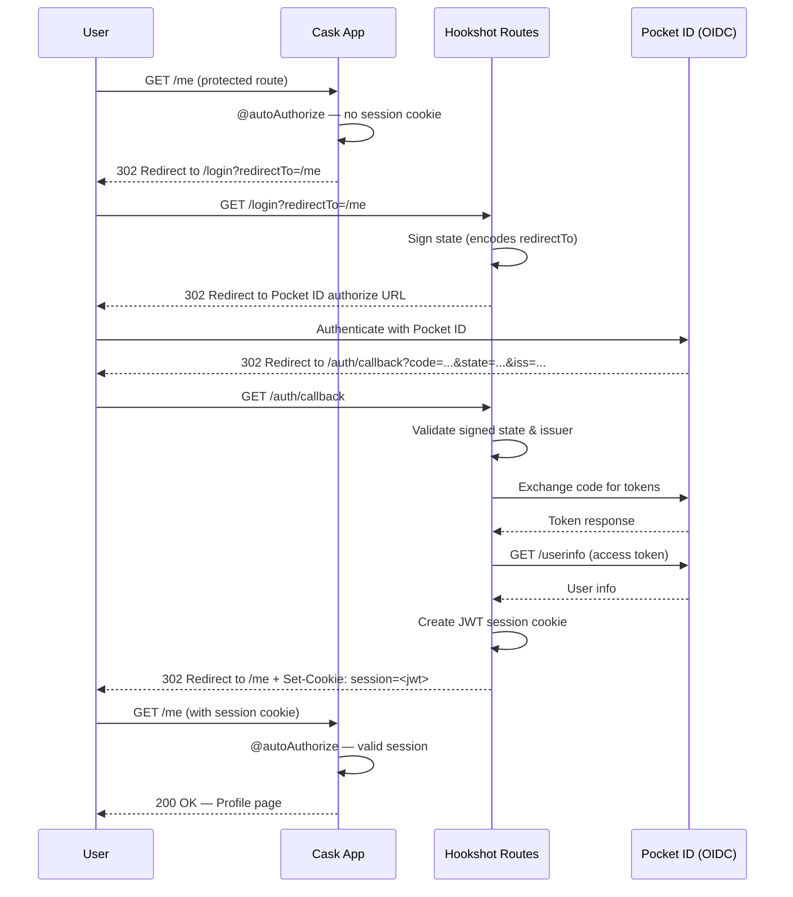
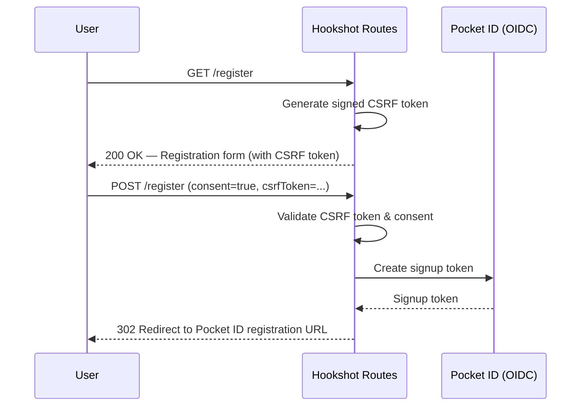

# Hookshot

Hookshot is a Scala library that adds OpenID Connect authentication to [Cask](https://com-lihaoyi.github.io/cask)
web applications using a self-hosted [Pocket ID](https://pocket-id.org) instance as the identity provider.

It provides drop-in routes for login, logout, registration, and an OIDC callback — along with route decorators and
JWT-based session management — so you can secure your app without wiring up the auth plumbing yourself.

The library aims to be general-purpose, though it may carry a few opinions specific to the author's setup. Contributions
to make it more flexible are welcome!

I've chosen to use Pocket ID because

- It's easy to set up
- Has a nice UI/API
- It only uses [passkeys](https://www.passkeys.io) - no storing user passwords!

## Routes

Hookshot provides the following routes via `PocketIdRoutes`:

| Method | Path             | Description                                                                                                                                                                                                        |
|--------|------------------|--------------------------------------------------------------------------------------------------------------------------------------------------------------------------------------------------------------------|
| GET    | `/login`         | If the user already has a valid session, redirects to `/`. Otherwise, signs a state token (encoding an optional `redirectTo` param) and redirects to the Pocket ID authorization URL to begin the OIDC login flow. |
| GET    | `/auth/callback` | OIDC callback endpoint. Validates the signed state and issuer, exchanges the authorization code for tokens, fetches user info, creates a JWT session cookie, and redirects the user to their original destination. |
| GET    | `/logout`        | Clears the session cookie and redirects to `/`.                                                                                                                                                                    |
| GET    | `/register`      | If the user already has a valid session, redirects to `/`. Otherwise, renders a registration consent form with a signed CSRF token.                                                                                |
| POST   | `/register`      | Validates the CSRF token and consent checkbox, then creates a one-time signup token via the Pocket ID API and redirects the user to complete registration on Pocket ID.                                            |

## Diagram and Flow

### Login / Authentication

When an unauthenticated user hits a protected route (decorated with `@autoAuthorize`), they are automatically redirected
through the OIDC login flow. Routes decorated with `@maybeAuthorized` will pass through an
`Option[UserSession]` without redirecting.



### Registration

Unauthenticated users can self-register through a consent form protected with a CSRF token. On acceptance, Hookshot
creates a one-time signup token via the Pocket ID API and redirects the user to complete registration.



### Logout

This library doesn't persist any auth tokens from the OIDC server, so a logout is done via clearing the session cookie.

### Decorators

Hookshot provides three decorators for protecting routes:

| Decorator          | Behavior                                                                    |
|--------------------|-----------------------------------------------------------------------------|
| `@autoAuthorize`   | Redirects unauthenticated users to `/login`, then back after authentication |
| `@authorized`      | Returns `401 Unauthorized` if no valid session is present                   |
| `@maybeAuthorized` | Passes `Option[UserSession]` to the handler — never blocks the request      |

### Example

A minimal Cask app using Hookshot:

```scala
object App extends cask.MainRoutes {

  @autoAuthorize
  @get("/me")
  def me()(session: UserSession): Response[String] = {
    Response(s"Hello, ${session.sub}!")
  }

  initialize()

  override def allRoutes: Seq[Routes] = {
    PocketIdRoutes() +: super.allRoutes
  }
}
```

Adding `PocketIdRoutes()` to `allRoutes` mounts the `/login`, `/logout`, `/auth/callback`, and `/register` endpoints
automatically.

## JWTs / UserSession

After a successful OIDC login, Hookshot creates a signed JWT and stores it in a `session` cookie. The JWT encodes a
`UserSession`, which is the primary model your application interacts with.

### UserSession

| Field      | Type                  | Description                                                      |
|------------|-----------------------|------------------------------------------------------------------|
| `sub`      | `String`              | The user's OIDC subject identifier                               |
| `exp`      | `Long`                | Token expiry (epoch seconds)                                     |
| `iat`      | `Long`                | Token issued-at (epoch seconds)                                  |
| `userInfo` | `OIDCUserInfo`        | The full OIDC user info payload from Pocket ID (see below)       |
| `dynamic`  | `Option[ujson.Value]` | Optional app-specific data encoded as arbitrary JSON (see below) |

A `UserSession` is considered valid when the current time falls between `iat` and `exp`.

### OIDCUserInfo

The `userInfo` field contains the standard OIDC claims retrieved from the Pocket ID `/userinfo` endpoint:

| Field            | Type                  | Description                         |
|------------------|-----------------------|-------------------------------------|
| `sub`            | `String`              | Subject identifier                  |
| `email`          | `Option[String]`      | Email address                       |
| `name`           | `Option[String]`      | Full display name                   |
| `given_name`     | `Option[String]`      | First name                          |
| `family_name`    | `Option[String]`      | Last name                           |
| `picture`        | `Option[String]`      | Profile picture URL                 |
| `email_verified` | `Option[Boolean]`     | Whether the email has been verified |
| `groups`         | `Option[Set[String]]` | Groups the user belongs to          |

### Dynamic Claims (Per-App Data)

The `dynamic` field allows each application to embed its own arbitrary data into the session JWT. When calling
`UserToken.createToken`, you can pass a `dynamicClaims: Option[ujson.Value]` parameter with any JSON value. This is
useful for storing app-specific session state — roles, preferences, feature flags, etc. — without needing a separate
session store.

For example, the default callback in `PocketIdRoutes` passes the full `OIDCUserInfo` as the dynamic payload:

```scala
val jwt = UserToken.createToken(
  userInfo,
  3600 * 24,
  Some(upickle.writeJs(userInfo))
)
```

You could instead store application-specific data:

```scala
val jwt = UserToken.createToken(
  userInfo,
  3600 * 24,
  Some(ujson.Obj("role" -> "admin", "theme" -> "dark"))
)
```

The `dynamic` field is then available on `UserSession` in your route handlers via `session.dynamic`.

### Configuration

Hookshot is configured via environment variables. `.env` files are supported
via [Veil](https://github.com/alterationx10/veil).

#### Pocket ID / OIDC

| Variable             | Description                                                                                 | Default                 | Required |
|----------------------|---------------------------------------------------------------------------------------------|-------------------------|----------|
| `POCKET_ID_ENDPOINT` | Root URL of your Pocket ID instance                                                         | `http://localhost:1411` | No       |
| `OIDC_CLIENT_ID`     | OIDC client ID for your application                                                         | —                       | Yes      |
| `OIDC_CLIENT_SECRET` | OIDC client secret for your application                                                     | —                       | Yes      |
| `OIDC_REDIRECT_URI`  | The callback URL registered with Pocket ID (e.g. `https://myapp.example.com/auth/callback`) | —                       | Yes      |
| `POCKET_ID_API_KEY`  | API key for the Pocket ID instance, needed to create signup tokens for `/register`          | —                       | Yes      |

Note that currently `OIDC_REDIRECT_URI` should be configured on the Pocket ID instance to be `/auth/callback`, as that
is the provided route.

#### JWT

| Variable     | Description                                     | Default                          | Required |
|--------------|-------------------------------------------------|----------------------------------|----------|
| `JWT_SECRET` | Secret key used to sign and verify session JWTs | Random value (logged as warning) | No       |
| `JWT_ALG`    | Signing algorithm — `HS256` or `HS512`          | `HS256`                          | No       |

Not setting `JWT_SECRET` is ok for local testing, but should be set explicitly if deployed - otherwise multiple
instances or process restarts won't be able to validate each other's sessions!